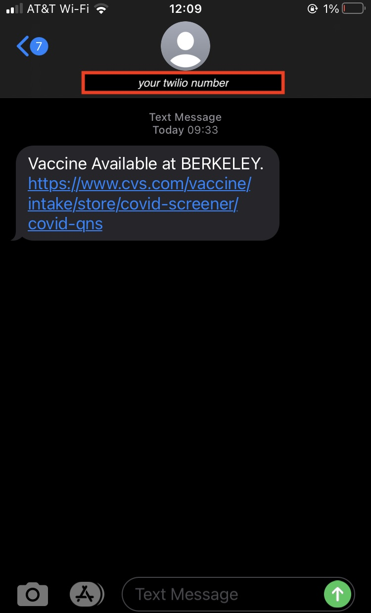

# Vaccine Checker
This script currently checks CVS Pharmacy locations to see if there are any appointment availabilites for scheduling a vaccine. If there are, the script will send you a text message using Twilio.

# Disclaimer
I wrote this in like 1 hour. It currently only supports checking CVS Pharmacy in the state of california. You'll have to adjust the URL in the script to change it to other states.

If you want to receive the text message, you'll need a Twilio number.

If you found this code useful, consider supporting my late mother's children's alphabet book -- a beautifully illustrated work, supported by over 180 people from around the world. I've included free shipping (discount code PYTHONISTA) for anyone coming through this link. [Journey From A to Z with Teacher Judy](https://teacherjudy.com/discount/PYTHONISTA)

# Setting up on a Cron
I set up a crontab with the script to run it every 5 minutes. 

# Supporting This
If you'd like to help me expand where the script checks, let me know.

If you found this code helpful for saving your own time helping you get a vaccine appointment, or you simply want to support a cool independently published children's book, **please check out my late mother's work! I've included free shipping (discount code PYTHONISTA) for anyone coming through this link. [Journey From A to Z with Teacher Judy](https://teacherjudy.com/discount/PYTHONISTA)**